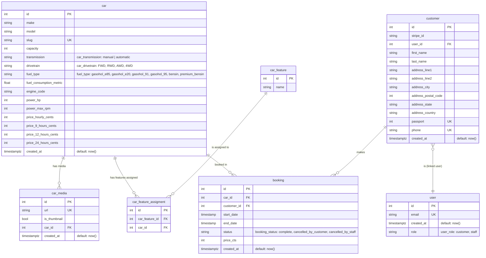

# Furai API

 

This is the REST API for [Furai car rental](https://github.com/brdtheo/furai) built with Django Rest Framework

## Database schema

The database models are relatively simple. We have cars, customers and each customer can create a booking from a car. A customer is always related to a user for authentication purposes.

